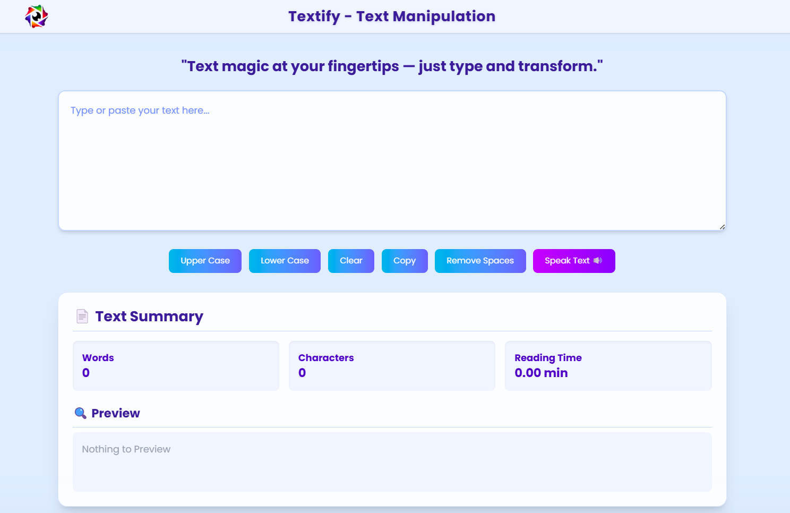

## **Preview**

# **Textify App** 

**Textify** is a powerful tool for text manipulation that provides users with a variety of features like converting text to uppercase or lowercase, copying text, removing extra spaces, showing reading time, and even converting text to speech. Whether you're editing, formatting, or listening to your text, **Textify** makes the process easy and efficient.

---

## **Description** 

Textify is a versatile text manipulation app that allows users to perform common text operations with ease. It helps to transform, format, and analyze text efficiently. With a user-friendly interface and various features, Textify can be used for writing, editing, accessibility, and more.

---

## **Features** ✨

- **Uppercase/Lowercase**: 🔠 Convert selected text to uppercase or lowercase with one click.
- **Text Copying**: 📋 Copy the modified text to the clipboard easily.
- **Remove Extra Spaces**: ✂️ Clean up the text by removing leading, trailing, and extra spaces between words.
- **Reading Time**: ⏳ Automatically calculates and shows an estimated reading time for your text.
- **Text-to-Speech**: 🔊 Convert text into speech and listen to it in a natural voice.
- **Text Preview**: 👀 Display a preview of your modified text as you edit.

---

## **Tech Stack** 🛠️

- **Frontend**:  
  - **React** – A JavaScript library for building user interfaces.
  - **Vite** – A fast and lightweight build tool for modern web apps.
  - **Tailwind CSS** – A utility-first CSS framework for custom styling.

